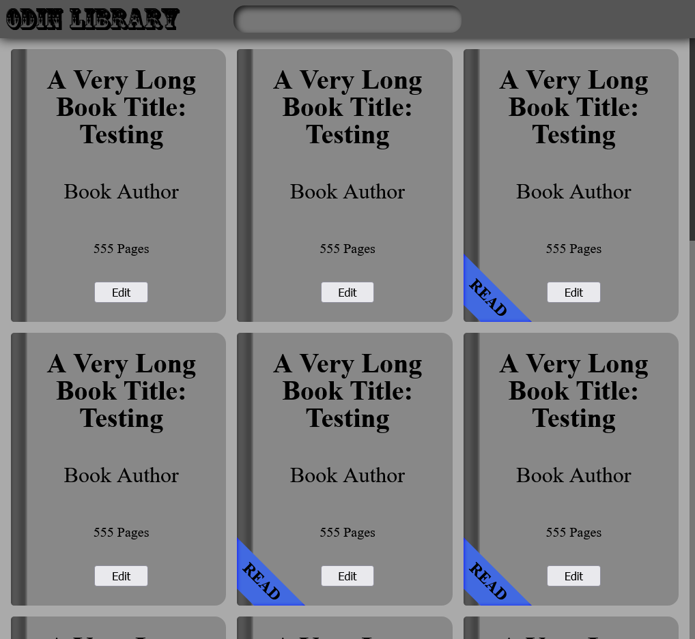
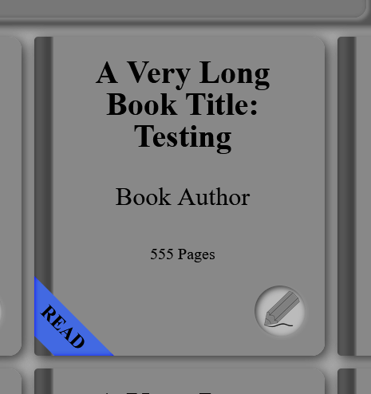
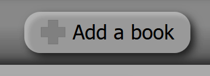
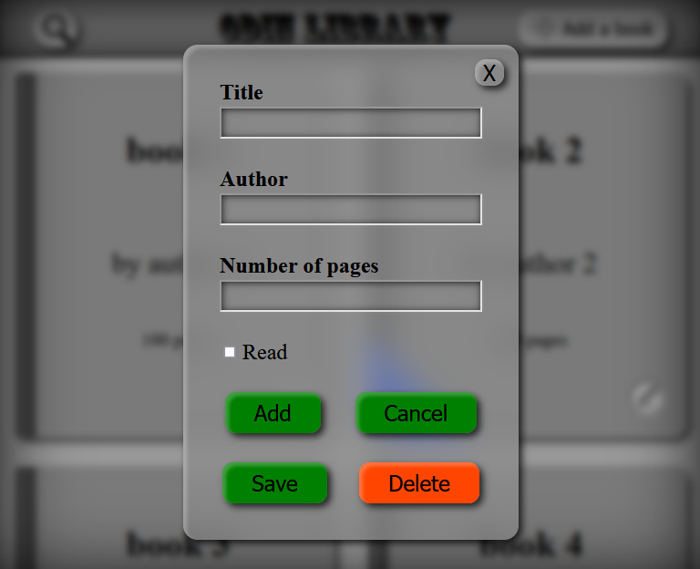
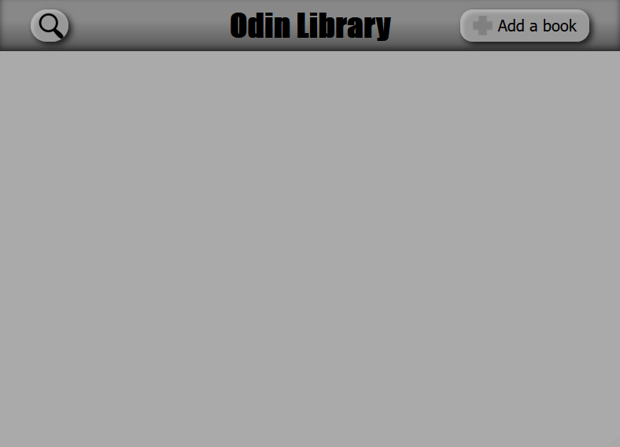
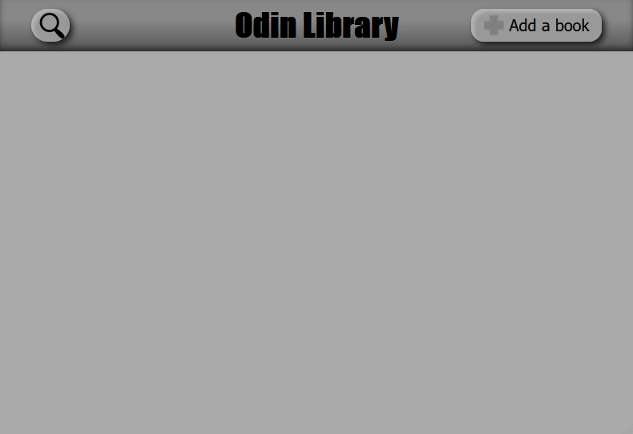
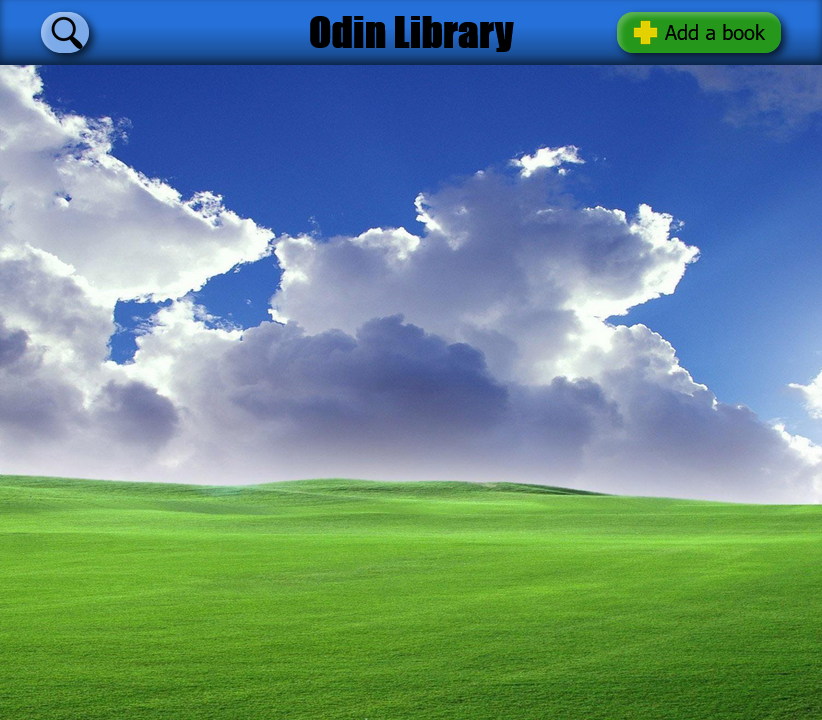

# odin-library

## Live: 
## https://hectorvilas.github.io/odin-library/

## About the project:

This time I'm making a library. This will be a single page, where the user can make a list with books, indicating name, author, number of pages and if it was read or not.

This is just another practice. This time it's about object constructors, first with the "old" way (`function` constructors and `prototype`s), then the modern way (`class`, `constructor`, etc), the "syntactical sugar" way, as introduced in ECMAScript 6 in 2015.

I took a peek to the next lessons because I wanted to use classes, but the code needs to be written the "old" way, then be refactored with `class`, so I'm going to start with function constructors.

This is how it should start:

```javascript
let myLibrary = [];

function Book() {
  // the constructor...
}

function addBookToLibrary() {
  // do stuff here
}
```

## what I plan to do:

I was thinking on making something more visual, like a bookshelf with physical books representing each one, but I may get carried away from the objective, so I'll start with something basic, then go nuts with the design. As a little roadmap, here is what I need:

### the page:
- a header
- an "add book" button
- an image for the empty state and some sugestion
- the main content with `display: grid` to show the books list in cards, with:
- - the book title
- - the author
- - number of pages
- - a disabled checked/unchecked checkbox showing the "read" status
- - an "edit" button
- an edit/add book modal with:
- - an input text for book title
- - an input text for author
- - an input number for pages
- - a checkbox for "read"
- - a "save"/"add" button (context sensitive)
- - a "cancel"/"delete" button (context sensitive)

### the code:
- an array to store all the books as objects
- a function constructor that will have:
- - an array for the book's title
- - an array for the book's author name
- - a num primitive for number of pages
- - a boolean for "read" status
- a prototype for a shared function to toggle the "read" status
- as sugested by the course, the index may be stored in the DOM as a data-attribute

I think this is enough to start. As always, I'll update this README.md with my progress.

## update 1
I started with the project, nothing special, just a `<header>` and a `<main>`. I've been browsing for color palletes, but I think I need more than those two things before deciding for this, so I made everything grayscale for now.

I downloaded the Coffee Tin font from [here](https://www.1001freefonts.com/coffee-tin.font) to use in the project. This font looks amazing, but I'm not sure how I should handle it, having a very black top half and mostly transparent bottom half. For now I'm using it in the title.

After this, I started writing the `CSS`, preparing the terrain for the cards. I went for the `grid` display, with `auto-fit` for columns, so it can adjust itself dynamically depending on the viewport width.

Then I started with the card design. It looked so bland, so I changed it's borders and added a linear-gradient to make it like a book. It was going to have a disabled checkbox to indicate the read status, but I went for something a little different: a ribbon with a "read" message wrapped in the corner of the book (the card).



The ribbon is a `::before` and `::after`. The text is isolated in one of those so I can rotate it 45° without rotating the full object. The other one is the ribbon itself, it's shape was made with `clip-path`, then moved to the bottom left of the card. A `box-shadow` has been applied with `inset` to give it a 3D feeling, like going around the book.

For now those cards are placeholders. `JavaScript` has only been used to clone the card so I can see how it behaves with thy dynamic `grid`. Then I added the "read" class to some of the cards to check how the ribbon looks.

The card got a little edit:



First the `:hover` had a transition, but felt weird having a button, so I change it to a glow effect. I'm still not sure if I'm going to keep it, everything in the page now looks... blurry.

I also spent some time drawing a new icon for the edit button. I think now I get how InkScape works. I was expecting to draw with vectors freely, merging nodes and especting to still be a single object (like I did in the old Macromedia Flash 5 in my teen years). So I drew the pencil with individual lines, then re-drew each part as an individual object.

### next steps
I want to play a little more with `CSS`, maybe add something else in the header (I'm even thinking on making it into a footer), try some palettes and fonts, then I should start working with the code.

### edit
I forgot to mention that I'm working with the [meyerweb's CSS reset](https://meyerweb.com/eric/tools/css/reset/) to normalize properties between browsers, also to not have to remove `padding` and `marging` on almost everything. It feels like I have to do some extra work with it, like adding again font size, weight and other properties to `<h1>`. Anyways, I just wanted to experience working with something like this.

## update 2
I've been making adjusts in the `CSS` here and there, trying to remove the blurriness. The cards don't have a `:hover` effect anymore, it's shadow are les diffuse, the header got it's `filter: drop-shadow()` replaced by `box-shadow` with `inset` property to not lose the non-flat feeling.

After this, I went for the search bar. It will be compressed when unfocused. Once the user focuses it, or if it still have some text on it, it will expand. The background color and magnifier glass icon will be lighter.


### next steps
I still don't know about the pallete, it will be kept as grayscale for now. I should finally focus in the `JavaScript` code.

## update 3
Today I finished with the styling. I made a lot of minor changes to existing elements, except for the color palette. I also disabled most of the transitions. I like it, but also there's too much movement in the page, so for now the only animated item is the search bar expanding.

Then I noticed I forgot to add a button to create cards, so I used the empty space at the right of the header. Added a little plus icon at the left of it's text, to make it more noticeable. I may change it's color to green, feels appropiate.



After finishing with the fun part, I started with `JavaScript`, the even more fun part. I made an array to store the books as objects and filled it with placeholders.

```javascript
let myLibrary = [
  {title: "book 1", author: "author 1", pages: 100, read: false},
  {title: "book 2", author: "author 2", pages: 200, read: true},
  {title: "book 3", author: "author 3", pages: 300, read: false},
  {title: "book 4", author: "author 4", pages: 400, read: false},
  {title: "book 5", author: "author 5", pages: 500, read: false}
];
```

Then I wrote a function to show each book as a card in the page. This is the code:

```javascript
function placeBooks() {
  main.innerHTML = "";

  myLibrary.forEach((book, i) => {
    const card = document.createElement("div");
    card.classList.add("card");
    
    if(book.read) card.classList.add("read");
    
    card.setAttribute("data-index", i);

    const title = document.createElement("p");
    title.classList.add("title");
    title.innerText = book.title;
    card.appendChild(title);
    
    const author = document.createElement("p");
    author.classList.add("author");
    author.innerText = `by ${book.author}`;
    card.appendChild(author);

    const pages = document.createElement("p");
    pages.classList.add("pages");
    pages.innerText = `${book.pages} pages`;
    card.appendChild(pages);
    const edit = document.createElement("button");
    edit.classList.add("edit");
    const image = document.createElement("img");
    image.src = "./media/icons/edit.png";
    edit.appendChild(image);
    card.appendChild(edit);

    main.appendChild(card);
  });
};
```

It's not intuitive at all, but this is the way I learned to do it. I may change it for an easier to read `.innerHTML` in the future if it is possible.

### next steps
I've been looking for info about modals (I wrongly called them prompts in the past) and it's really easy to use and tweak, so I'm going to make one for the book creation. On my personal projects I made modals in a "hacky way", this time I'm doing it right. I'm going to use all the knowledge I got from one of the previous practices, [forms](https://github.com/HectorVilas/odin-form), to make it look and feel good.

Once I have a functional modal, I should keep working with the code. I have to make a `constructor` for books and let the modal set it's data.

## update 4
Today I've been working in the modal. I made it simple: the 3 necessary entries and a checkbox for "read". The rest of the work has been styling, to keep the aesthetics of the rest of the page. As a little extra, I used the property `backdrop-filter` to add a blur effect, now that it works on Firefox. Anyways, I used the `@supports` rule on `CSS` to replace it with a solid background in case the browser is not compatible. I'm not sure if I wrote it right, I don't have where to test it, now that it have support in all desktop browsers.

```CSS
@supports not (backdrop-filter: blur(1rem)) {
  .modal-add-edit {
    background: rgb(125, 125, 125);
  }
}
```

After this, I added two set of buttons: a pair for editing and another for adding. Those are visible for now:



A little of `JavaScript` has been written to make it possible to show and hide the modal. I had to look for the methods to show and hide it, then I remembered I can see all methods from the browser's inspector, under `prototype`. Next time I'm checking here before looking on internet.

### next steps

I'm planning to use the same modal for two actions, so I'm going to hide both sets and then show the relevant, depending on the context.

### thoughts
I noticed I always start styling everything once I have something on screen. I should leave that for later, because that's not the most important part. I must work on it.

## update 5
I just wrote the constructor function and made the modal's inputs fill the info. About the two pairs of buttons on it, they are hidden by default. As the function to show the modal came from the "Add a book" button, the relevant pair is showed. When the modal is closed (by book added, pressed the esc key or any other way), all the buttons are hidden again.

If a book has been added, after pushing the new object to the array containing them, the cards will be redrawn. I don't know if this is a lazy way to do it, but for now it works flawlessly and no errors can be commited.

Here is a little GIF adding two books to the list:



### next steps
It's time to make something with the empty state. I should be able to do something with `CSS` only, maybe with `main:empty`, adding a background image with some draws, text and an arrow pointing to the "Add a book" button.

Something else I should do, to finish this practice, is letting the user edit the existing books, to change it's info or delete it.

Another thing I was thinking is using `<form>` and focusing the first input field, so the book can be created without any mouse interaction.

## update 6
The page is now functional, except for the search and there's no responsiveness yet.



The first change I did was remove the CofeeTin font, because I was receiving errors in the console. After a little search I found this font in particular have some problems and had to be fixed using third party software. I decided to just remove the font, it was hard to read anyways.

Then i've been adding comments on top of the functions to describe what it does, in case I forget in the future, or somebody else wants to read it.

Next, I worked in the edit menu. It's the same modal, but if it was invoked with an edit button, it will show the relevant buttons, autofill the input fields and check or uncheck the checkbox. It will also store the index of the selected book in a global array, so it can know which one is being modified or deleted.

Pressing "save" will replace the book's info with the new data, finding it with the index saved in the global variable. Pressing "delete" will remove it. To remove the book, I used the `.filter()` method.

```javascript
//store globally the index for editing/deleting existing card
let idx;

//...

[btnModalSave,btnModalDelete].forEach(btn => {
  btn.addEventListener("click", edditBookOnLibrary);
});

//...

//edit or delete existing book in myLibrary
function editBookOnLibrary() {
  //...
  } else if(this.className.includes("delete")){
    myLibrary = myLibrary.filter((item, i) => i != idx);
  };
  //...
}
```

I find this way much faster and intuitive than `.slice()` and other methods. The parameter "item" is not used, but can't be omitted.

### next steps
I should change the "delete" hover color, it souldn't be green. I'm also planning to add more styles to the page, or at least a toggleable minimalist design. I don't know where to put this button or checkbox, because the page doesn't have a navigation bar (it was too simplistic to have one).

I also have to work in the search. It's not part of the practice, but I put it up there, so I should make it functional. It should filter the books' array and then show on the page those matching the search, or maybe grayout those that doesn't match. I think the former is the better option.

I was also thinking to match the input width of the search bar when unfocus, using the `ch` unit for the length. I heard something like this was sugested for the next W3C, I hope they normalize a property for this, but for now I'll have to use `JavaScript`.

I still have to design something for the empty state of the page.

### thoughts
I feel like I'm not learning too much from this practice, maybe because I learned most of this from my other personal projects. I want to move on already. Once the search bar is functional, the project is over, unles I came with a new idea.

I also need to come up with better class and function names. Most days I watch some frontend videos (tutorials, tips and tricks), I love to learn little new things, and started noticing how easy to understand are the naming those devs use for everything. My naming is not always obvious, so I should work on it for my next project.

## update 7
Today I've been working in the visuals. First of all, I changed the color palette to make the page look like Windows XP. I also added a Windows XP wallpaper from [wallpapercave.com](https://wallpapercave.com/w/wp2754869) to complete the look.



Then, just in case, I moved all the colors and shadows to variables in `:root`, so I have everything in a single place. Easier to change, easier to repeat values and, in case I want to make a dark or minimalistic theme, I just have to change those values.

And finally I made little changes in the code. I added a condition to prevent creating books without a title. If the user tries to create or edit a book without title, the modal won't disappear and the title input will flash a little. Also this input field now have autofocus, making hard to miss the title. The cards can still be created without author or number of pages. "by" and "pages" was always showing, so I added an extra condition to not show them in case their respective inputs are empty.

### next steps
I need to work in two more things before finishing the practice:
- books are still grayscale. Now the page is a little colorful, so I should do something with that. ¿Let the user pick a color? ¿A random color for each book? I don't know yet.
- the search bar is still not functional and everyday feels a little more intimidating. I should finally "face this demon" and let it filter the books. Should be easy, but I still don't have planned my approach. I can make it search books, include authors or maybe apply some regEx magic and let it search the way Visual Studio searchs  in the intelliCode (the suggestion boxes), in which I could type "ader" and it will show "`ad`d`E`ventListene`r`".